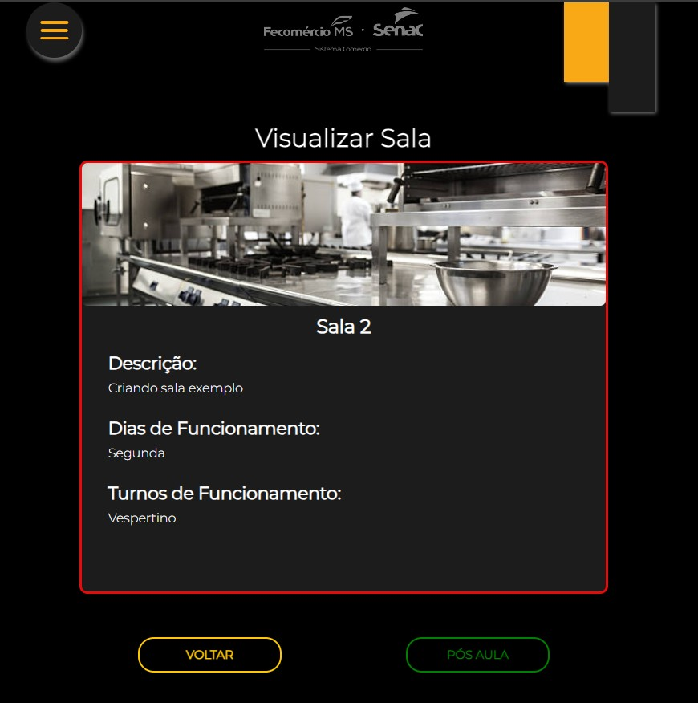
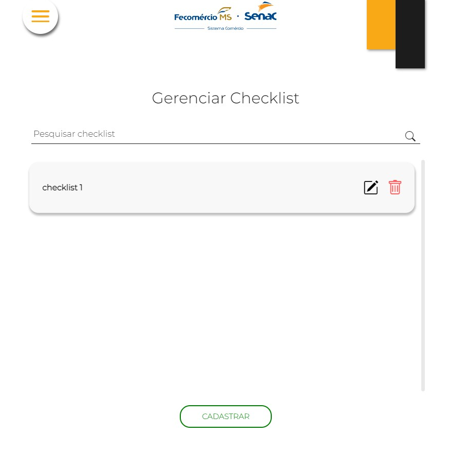
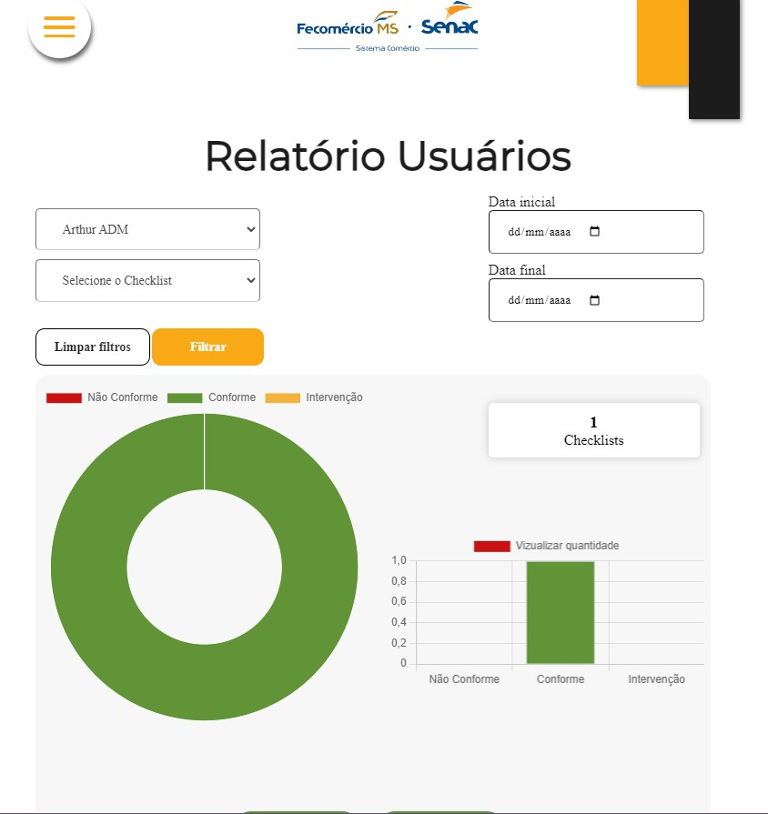
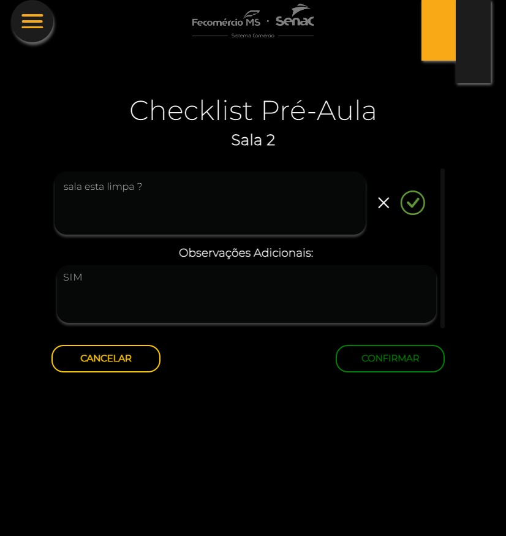
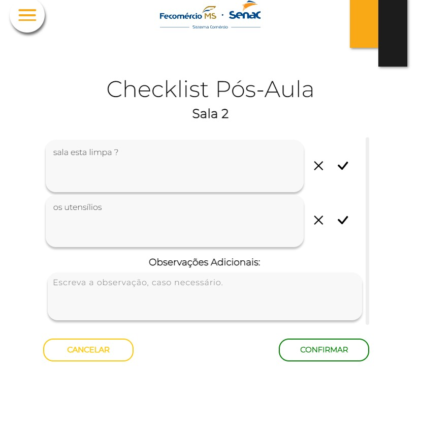
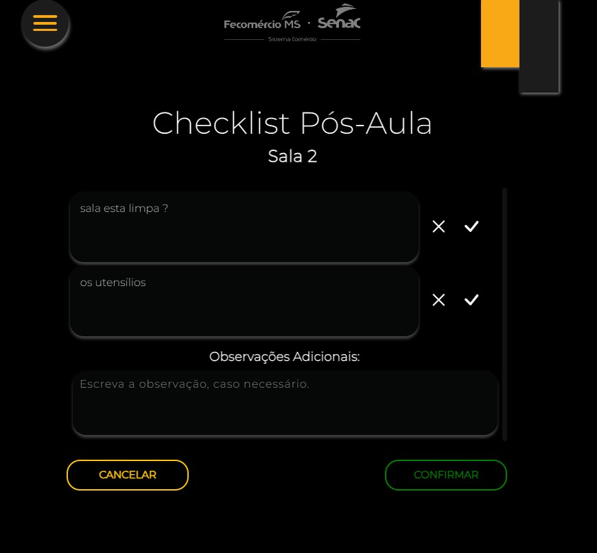
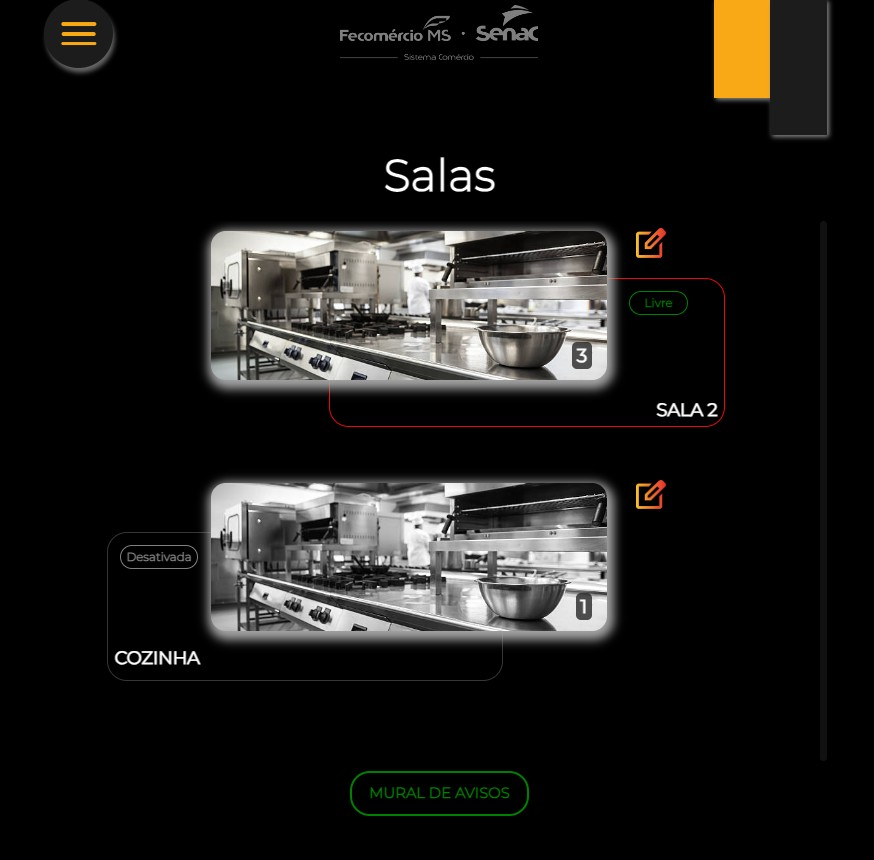

# ETG Restaurante

O **ETG Restaurante** é um sistema web desenvolvido como parte de um projeto prático para a unidade do **SENAC Gastronomia**. Seu objetivo é facilitar a organização interna do restaurante-escola, oferecendo ferramentas para controle de checklists, relatórios e comunicação da equipe.

## 📸 Prints do Projeto

| Checklist | Cadastrar Checklist | Relatório |
|:---------:|:-------------------:|:---------:|
|  |  |  |

| Infos ADM 1 | Infos ADM 2 | Botão Modo Dark |
|:-----------:|:-----------:|:----------------:|
|  |  |  |

| Realizar Checklist | Checklist 2 | Checklist Dark |
|:------------------:|:------------:|:---------------:|
|  |  |  |

| Recados 1 | Recados 2 | Salas |
|:----------:|:----------:|:------:|
|  |  |  |

| Salas 2 |
|:--------:|
|  |

## 🚀 Tecnologias Utilizadas

Este projeto foi desenvolvido utilizando as seguintes tecnologias:

- **HTML5** e **CSS3** — Para estruturação e estilo.
- **JavaScript** — Para interatividade e validações.
- **PHP** — Para regras de negócio e conexão com o banco de dados.
- **MySQL** — Utilizado como banco de dados relacional.
- **SQL** — Linguagem de consulta para manipulação dos dados.
- **Git** e **GitHub** — Versionamento e colaboração no código.
- **Metodologias Ágeis** — Organização e divisão de tarefas no time.

## 📁 Estrutura do Projeto

- `pages/` — Contém as páginas funcionais do sistema.
- `includes/` — Componentes reaproveitáveis como conexões e menus.
- `assets/` — Imagens, arquivos de estilo e scripts JavaScript.
- `Prints/` — Pasta contendo capturas de tela do sistema.
- `banco_etg.sql` — Estrutura do banco de dados.

## 💡 Funcionalidades

- Criação e acompanhamento de checklists operacionais.
- Controle administrativo com base em relatórios.
- Comunicação via mural de recados.
- Interface leve e funcional.

## 📌 Requisitos

- PHP 7.4 ou superior
- MySQL
- XAMPP, WAMP, Laragon ou qualquer outro ambiente local

## ⚙️ Configuração e Deploy

1. Copie `config.ini.example` para `config.ini` e preencha os valores do ambiente.
2. Importe `banco_etg.sql` no banco de dados.
3. Rode `composer install` na raiz (gera o `vendor/autoload.php` exigido pelas páginas).
4. Garanta que `storage/salas/`, `storage/n_conformidade/` e `storage/acao_corretiva/` sejam graváveis.
5. Emails (SMTP): preencha `[mailer]` em `config.ini` — o remetente real deve ser configurado no servidor e **não versionado** (o arquivo `config.ini` está no `.gitignore`).
6. URL pública: preencha `[app] base_url` em `config.ini` (ex.: `https://etg.exemplo.com.br`). Se vazio, a URL é detectada automaticamente a partir da requisição.

> ⚠️ `config.ini` não é versionado — nunca comite credenciais reais nele.

### Deploy no Render (plano free)

O arquivo [`render.yaml`](render.yaml) configura um web service PHP.

1. Crie um banco **MySQL** grátis (ex.: [freesqldatabase.com](https://www.freesqldatabase.com) ou [db4free.net](https://www.db4free.net)).
2. Importe `banco_etg.sql` nesse banco (phpMyAdmin → Import).
3. No Render: **New → Blueprint**, aponte para este repositório.
4. Em **Environment → Environment Variables**, preencha: `DB_HOST`, `DB_NAME`, `DB_USER`, `DB_PASSWORD`, e (se quiser e-mail) `SMTP_USER`, `SMTP_PASSWORD`, `SMTP_FROM`.
5. Deploy. O app abre na URL do Render (defina `APP_URL` com essa URL).

> Acessos locais funcionam pelo `config.ini`; no Render, as variáveis de ambiente (`DB_*`, `SMTP_*`, `APP_URL`) têm prioridade.
> ⚠️ No plano free o disco é efêmero: uploads em `storage/` não persistem entre deploys/restarts.

---

Desenvolvido com 💡 e ☕ por **Arthur Augusto** e equipe.
